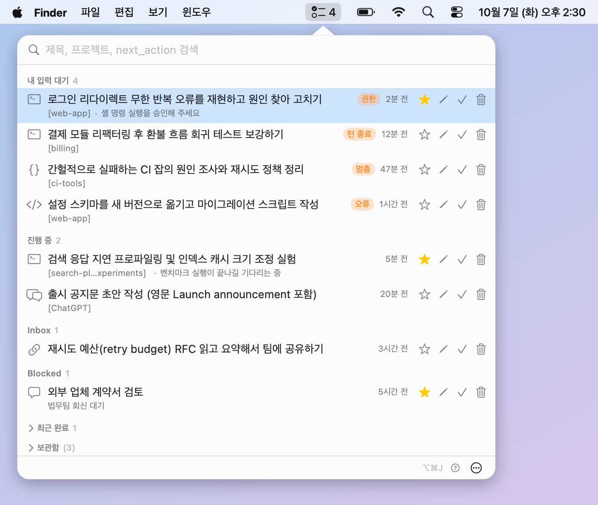

# JTM

**AI 에이전트 세션을 여러 개 동시에 돌리는 사람을 위한 macOS 메뉴바 태스크 매니저.**

한국어 · [English](README.md)

Claude Code, Codex, ChatGPT, 여러 개의 Orca 터미널을 한꺼번에 쓰다 보면 어느 세션이 내 입력을 기다리는지, 그 세션이 어디서 돌고 있는지 잊어버리기 쉽습니다. JTM은 이 모든 것을 메뉴바의 목록 하나로 모아 보여주고, 클릭하면 작업이 진행 중인 곳으로 바로 데려다 줍니다.



## 기능

- **자동 수집.** Claude Code와 Codex 훅이 대화형 에이전트 세션마다 티켓을 만들고 갱신합니다. 직접 입력할 필요가 없습니다. 훅이 놓친 에이전트 터미널은 Orca 폴러가 보충합니다.
- **내가 봐야 할 것을 한눈에.** 메뉴바 아이콘에 내 입력을 기다리는 세션 수(권한 요청, 턴 종료, 멈춤, 오류)가 표시됩니다. 팝오버는 *내 입력 대기*, *진행 중*, *Inbox*, *Blocked*, *최근 완료*로 티켓을 나눠 보여줍니다.
- **바로 이동.** 행을 클릭하거나 Enter를 누르면 그 티켓이 속한 Orca 터미널, Codex 스레드, ChatGPT 대화, Claude 채팅이 열립니다. [이동 방식](#이동-방식)을 참고하세요.
- **수동 보강.** 자동 수집은 "어디서, 언제"를 채우고, 사람은 "왜, 다음에 뭘"을 채웁니다. 제목, 다음 할 일, 메모, 프로젝트를 고칠 수 있고, 고친 내용은 자동 수집이 덮어쓰지 않습니다.
- **스스로 정리.** 손대지 않은 티켓은 세션이 끝나면 완료되고, 24시간 동안 활동이 없으면 보관함으로 갑니다. ⭐(유지)를 누르면 정리 대상에서 빠지고, 보관함에서 되살릴 수 있고, 세션을 무시해서 다시 생기지 않게 할 수도 있습니다.
- **키보드 중심.** 전역 단축키 <kbd>⌥</kbd><kbd>⌘</kbd><kbd>J</kbd>, 열면 검색창에 포커스, 방향키와 Enter로 이동합니다.
- **스크립트 가능.** 앱이 하는 일은 모두 `jtm` CLI로도 할 수 있고, 대부분의 명령이 `--json` 출력을 지원합니다.
- **로컬 전용.** 서버, 계정, 원격 수집이 없습니다. [개인정보](#개인정보)를 참고하세요.

## 요구 사항

- macOS 14(Sonoma) 이상.
- Apple Silicon 또는 Intel. 빌드마다 다르며, 릴리스마다 zip이 어느 아키텍처용인지 적혀 있습니다. 어떤 Mac이든 [소스에서 빌드](#소스에서-빌드)할 수 있습니다.
- 선택: 터미널 이동과 터미널 기반 수집에는 Orca 멀티 에이전트 IDE, `codex://` 링크에는 Codex / ChatGPT 데스크톱 앱. 없어도 JTM은 동작하고, 없는 부분만 건너뜁니다.

## 설치

```sh
curl -fsSL https://raw.githubusercontent.com/hiphapis/jtm/main/scripts/install.sh | sh
```

스크립트는 [GitHub Releases](https://github.com/hiphapis/jtm/releases)에서 최신 `JTM-<version>.zip`을 내려받아 `JTM.app`을 `~/Applications`에 설치하고, CLI를 `~/.local/bin/jtm`에 연결합니다(앱 번들 안의 `Contents/Helpers/jtm`을 가리키는 심볼릭 링크이며, `~/.local/bin`이 `PATH`에 있어야 합니다). 이어서 Claude Code / Codex 훅을 설치할지 묻고(`[y/N]`, 묻지 않고 설치하려면 `curl -fsSL … | sh -s -- --yes`) 앱을 엽니다. 훅을 건너뛰었다면 앱을 처음 열 때 설정 카드 **"CLI와 훅 설치"**가 나타나고, 언제든 `jtm hooks install`로도 설치할 수 있습니다.

### 디스크 이미지(.dmg)

끌어다 놓는 설치를 선호한다면, 각 [릴리스](https://github.com/hiphapis/jtm/releases)에는 `JTM-<version>.dmg`도 있습니다(옆의 `.sha256`으로 `shasum -a 256 -c JTM-<version>.dmg.sha256`처럼 확인할 수 있습니다). 이미지를 열어 `JTM.app`을 `Applications` 바로가기로 끌어다 놓고 앱을 실행하세요. dmg는 앱만 옮겨 둘 뿐이며, CLI와 훅은 앱의 설정 카드 **"CLI와 훅 설치"**가 설치합니다. 위의 `curl` 명령이 여전히 권장하는 방법입니다. CLI와 훅까지 한 번에 설치하고, 바로 다음에 설명하는 Gatekeeper 경고도 피할 수 있기 때문입니다.

### Gatekeeper에 대해

JTM은 Apple Developer ID가 아니라 임시(ad-hoc) 서명이어서, 브라우저로 내려받은 앱은 macOS가 막습니다. 위처럼 `curl`로 설치하면 내려받은 파일에 격리 표시가 붙지 않아서 이 문제가 없습니다.

그래도 브라우저로 zip이나 dmg를 받았다면(dmg에서 꺼낸 앱도 마찬가지입니다) 다음 중 하나로 여세요.

- `JTM.app`을 오른쪽 클릭해서 **열기**를 고르고 확인합니다.
- **시스템 설정 > 개인정보 보호 및 보안**에서 JTM 안내 옆의 **그래도 열기**를 누릅니다.
- 격리 표시를 지웁니다: `xattr -dr com.apple.quarantine /path/to/JTM.app`

### 설치 스크립트와 훅이 바꾸는 것

| 무엇 | 어디 |
| --- | --- |
| 앱 | `~/Applications/JTM.app` |
| CLI | `~/.local/bin/jtm` (앱 번들을 가리키는 심볼릭 링크) |
| Claude Code 훅 | `~/.claude/settings.json` |
| Codex 훅 | `~/.codex/hooks.json` |
| 데이터 | `~/Library/Application Support/jtm/jtm.sqlite` |
| 로그 | `~/Library/Logs/jtm/` |

훅 설치는 항목을 **추가만** 합니다(이벤트마다 하나, 끝에 `# jtm-managed` 표시). 이미 있는 훅은 건드리지 않고, 두 번 실행해도 결과가 같고, 먼저 파일 옆에 타임스탬프 백업(`<파일>.jtm-backup-YYYYMMDD-HHMMSS`)을 만듭니다. `jtm hooks install --dry-run`으로 미리 보고, `jtm hooks status`로 확인하고, `jtm hooks uninstall`로 되돌릴 수 있습니다. 되돌릴 때는 JTM이 추가한 항목만 지웁니다.

훅은 `jtm ingest`를 호출하는데, 몇 초 안에 끝나고 항상 exit 0으로 종료하므로 에이전트 세션을 막거나 실패시키지 않습니다.

## 삭제

```sh
curl -fsSL https://raw.githubusercontent.com/hiphapis/jtm/main/scripts/uninstall.sh | sh
```

훅, `jtm` 심볼릭 링크, 앱을 지우고 티켓은 남겨 둡니다. 데이터(티켓과 로그)까지 지우려면 이렇게 합니다.

```sh
curl -fsSL https://raw.githubusercontent.com/hiphapis/jtm/main/scripts/uninstall.sh | sh -s -- --purge
```

## 사용법

### 메뉴바 앱

아이콘을 클릭하거나 <kbd>⌥</kbd><kbd>⌘</kbd><kbd>J</kbd>를 누르세요. 행마다 목적지 아이콘, 제목, 프로젝트, 마지막 활동 후 경과 시간, 다음 할 일이 보입니다. 아이콘이나 버튼에 마우스를 올리면 뜻이 나오고, **?** 버튼을 누르면 범례가 나옵니다.

행 동작은 ⭐(유지), 다음 할 일 편집, 완료, 무시입니다. 단축키는 <kbd>⌘</kbd><kbd>S</kbd> 유지, <kbd>⌘</kbd><kbd>E</kbd> 편집, <kbd>⌘</kbd><kbd>D</kbd> 완료, <kbd>⌘</kbd><kbd>⌫</kbd> 무시, <kbd>⌘</kbd><kbd>R</kbd> 보관함에서 되살리기입니다. 팝오버 아래쪽 메뉴에 *로그인 시 자동 실행*, *Language / 언어*, *지금 동기화*, *종료*가 있습니다. 화면 언어는 기본적으로 macOS 언어를 따르고, *Language / 언어*에서 *시스템 설정 따름*, *English*, *한국어* 중에서 고르면 앱을 다시 켜지 않아도 바로 바뀌며 선택은 기억됩니다.

로그인 시 자동 실행은 터미널에서도 켜고 끌 수 있습니다: `open -a JTM --args --login-item on` (끄려면 `off`). 이미 실행 중인 앱에는 인자가 전달되지 않으므로 먼저 앱을 종료하세요.

앱은 항상 `open -a JTM`(또는 Finder, Spotlight, 로그인 항목)으로 실행하세요. 앱 번들 안의 실행 파일을 터미널에서 직접 실행하면 macOS가 메뉴바 항목을 "숨김"으로 기억해서, 이후 실행에서 앱이 바로 종료될 수 있습니다.

> 앱 화면은 **영어와 한국어**를 지원하고 macOS 언어 설정을 따릅니다. 선호 언어가 한국어인 Mac에서는 한국어, 그 외에는 영어로 보입니다. `jtm` CLI의 도움말과 메시지는 아직 한국어입니다.

### CLI

`jtm <명령> --help`로 각 명령의 설명을 볼 수 있습니다. 티켓 id는 `jtm ls`에 나오는 번호입니다.

| 명령 | 하는 일 |
| --- | --- |
| `jtm add <제목> [--url <url>] [--orca-terminal <handle>] [--project <이름>] [--next <내용>] [--status <상태>]` | 티켓을 만들고 id를 출력합니다. 직접 입력한 제목은 고정됩니다. ChatGPT와 Claude 채팅 URL은 자동으로 알아봅니다. |
| `jtm ls [--status <상태> ...] [--all] [--archived]` | 티켓 목록. 기본은 완료와 보관함을 숨깁니다. |
| `jtm show <id>` | 티켓과 모든 위치를 보여줍니다. |
| `jtm set <id> [--title <제목>] [--unpin-title] [--status <상태>] [--next <내용>] [--priority <숫자\|none>] [--project <이름>] [--note <메모>]` | 필드를 바꿉니다. `--next`, `--project`, `--note`에 빈 문자열을 주면 지웁니다. |
| `jtm done <id>` | 티켓을 완료로 바꿉니다. |
| `jtm go <id> [--location <id>] [--dry-run]` | 티켓의 목적지로 이동합니다. `--dry-run`은 실행하지 않고 명령만 출력합니다. |
| `jtm keep <id>` / `jtm unkeep <id>` | ⭐을 달아 자동 완료와 자동 보관에서 빼거나, ⭐을 뗍니다. |
| `jtm ignore <id>` | 티켓을 지우고 그 세션을 더 이상 수집하지 않습니다. |
| `jtm ignored` / `jtm unignore <세션 키>` | 무시한 세션 목록을 보거나, 다시 수집하도록 풉니다. |
| `jtm restore <id>` | 보관함에서 티켓을 되살립니다(유지 상태가 됩니다). |
| `jtm sync orca [--dry-run]` | Orca 폴러를 한 번 실행합니다. 앱은 30초마다 실행합니다. |
| `jtm prune workers [--dry-run]` | Orca 오케스트레이션 워커 세션이 만든 티켓 중 손대지 않은 것을 지웁니다. |
| `jtm retitle [--dry-run]` | 참조한 ChatGPT 대화에서 시작한 Codex 세션의 제목을 바로잡습니다. |
| `jtm hooks install\|uninstall\|status` | 에이전트 훅을 관리합니다. 셋 다 `--only claude\|codex`, `--claude-settings <경로>`, `--codex-hooks <경로>`를 받고, `install`과 `uninstall`은 `--dry-run`도, `install`과 `status`는 `--jtm-path <경로>`도 받습니다. |
| `jtm ingest claude\|codex` | 훅이 stdin으로 이벤트를 넘기며 호출합니다. 직접 쓰는 명령이 아닙니다. |

상태는 `inbox`, `active`, `waiting`, `blocked`, `done`입니다. 대부분의 명령이 `--json`을 받습니다. 보관함은 `jtm ls --archived`로 봅니다.

## 수집 대상

훅이 기록하는 이벤트는 Claude Code가 `SessionStart`, `UserPromptSubmit`, `Stop`, `StopFailure`, `PermissionRequest`, `PostToolUse`, `SessionEnd`, Codex가 `SessionStart`, `UserPromptSubmit`, `Stop`, `PermissionRequest`, `PostToolUse`입니다. `Stop`과 `PermissionRequest`는 티켓을 대기 상태로, 새 프롬프트는 다시 진행 중으로 바꿉니다.

일부러 수집하지 않는 것: 비대화형 에이전트 실행, Orca 오케스트레이션이 워커용으로 띄운 세션, Codex 데스크톱 앱이 스스로 돌리는 내부 작업. 실수로 무시된 세션은 `jtm ignored`와 `jtm unignore`로 되돌립니다.

## 이동 방식

티켓의 주 목적지는 Orca 터미널이 있으면 그것이고, 없으면 가장 최근에 본 위치입니다.

| 목적지 | JTM이 하는 일 |
| --- | --- |
| Orca 터미널 | `open -a Orca` 뒤에 `orca terminal switch --terminal <handle>`을 실행합니다. `orca` CLI가 `PATH`, `/usr/local/bin/orca`, 또는 `ORCA_CLI_COMMAND`에 있어야 합니다. handle이 낡았으면 포기하기 전에 다시 찾아봅니다. |
| Claude Code 세션 | 연결된 Orca 터미널을 엽니다. 실패하거나 터미널이 없으면 `cd '<cwd>' && claude --resume '<id>'`를 클립보드에 복사합니다. |
| Codex 스레드 | `open codex://threads/<id>`. ChatGPT 데스크톱 앱이 처리합니다. |
| ChatGPT 대화 | `open codex://threads/<chat id>`(같은 앱). 실패하면 웹 URL을 엽니다. 프로젝트 안 대화(`chatgpt.com/g/g-p-…/c/<id>`)도 됩니다. |
| Claude 채팅 | 저장된 `https://claude.ai/chat/<uuid>` URL을 브라우저로 엽니다. |
| 그 밖의 링크 | `open`으로 URL을 엽니다. `open`에 넘기는 스킴은 `http`, `https`, `codex`, `claude`뿐입니다. |

`jtm go <id> --dry-run`은 실제로 실행될 명령을 그대로 보여줍니다.

## 개인정보

- **모든 데이터는 내 Mac에 있습니다.** 티켓은 `~/Library/Application Support/jtm/jtm.sqlite`(`JTM_DB_PATH`로 바꿀 수 있음)에, 로그는 `~/Library/Logs/jtm/`(`JTM_LOG_PATH`로 훅 로그 위치를 바꿀 수 있음)에 저장됩니다. 업로드하는 것도, 분석 도구도 없습니다.
- **JTM은 네트워크를 쓰지 않습니다.** 네트워크 접근은 설치 스크립트를 실행할 때 GitHub에서 한 번 내려받는 것뿐입니다.
- **읽는 것.** 에이전트가 보내는 훅 페이로드(세션 id, 작업 디렉터리, 이벤트, 제목에 쓸 프롬프트 문장), `orca` CLI의 읽기 전용 목록(`worktree ps`, `terminal list`, 오케스트레이션 실행 목록), 그리고 Codex는 훅이 알려 준 세션 파일의 첫 줄(최대 64KB, 내 세션과 내부 작업을 구분하려는 용도)입니다. `jtm retitle`도 `~/.codex/sessions`를 같은 방식으로 읽기 전용으로 읽습니다.
- **실행하는 것.** `orca`(목록 조회와 터미널 전환), `open`, `pbcopy`. 그 밖에는 없습니다.

## 소스에서 빌드

macOS 14 이상에서 Xcode 16 또는 Swift 6.0 툴체인이 필요합니다.

```sh
git clone https://github.com/hiphapis/jtm.git
cd jtm
swift build            # CLI, 앱, 코어 라이브러리 디버그 빌드
swift test             # 단위 테스트 (실제 ~/.claude, ~/.codex, 데이터베이스는 건드리지 않음)
swift run jtm --help   # CLI

scripts/build-app.sh             # 릴리스 빌드 -> .build/JTM.app, ad-hoc 서명
scripts/build-app.sh --install   # 그 뒤 ~/Applications/JTM.app으로 복사 (실행 중인 JTM은 먼저 종료)
```

그다음 `open ~/Applications/JTM.app`으로 앱을 실행합니다. 변경을 보내기 전에 [CONTRIBUTING.md](CONTRIBUTING.md)를 읽어 주세요.

코드는 Swift 패키지 하나입니다: `JTMCore`(모델, SQLite 저장소, 수집, 이동 로직, Orca 동기화), `jtm`(CLI), `JTMApp`(SwiftUI/AppKit 메뉴바 앱). 에이전트 훅이 `jtm ingest`를 호출해 SQLite에 쓰고, 앱은 데이터베이스 파일을 감시해서 화면을 다시 그립니다.

## 라이선스

[MIT](LICENSE) © 2026 Johan Kim
