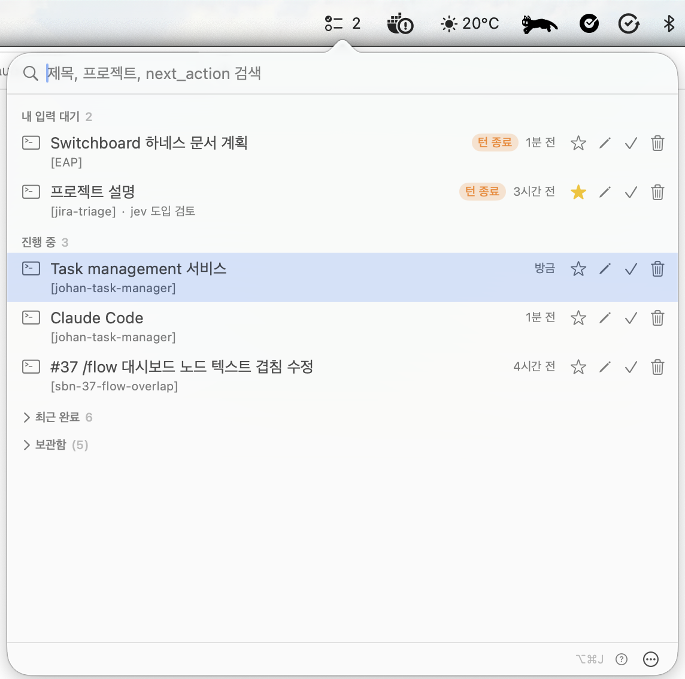

# JTM

**A menu bar task manager for people who run many AI agent sessions at once.**

[한국어](README.ko.md) · English

If you work with Claude Code, Codex, ChatGPT and several Orca terminals in parallel, work slips through the cracks: you forget which session is waiting for you and where it was running. JTM keeps one list of all of it in the macOS menu bar and takes you back to the place where the work is happening with a single click.



## Features

- **Automatic capture.** Hooks for Claude Code and Codex create and update a ticket for every interactive agent session, with no typing. The Orca poller adds agent terminals the hooks did not see.
- **Know what waits for you.** The menu bar icon shows how many sessions are waiting for your input (permission request, turn finished, stalled, error). The popover groups tickets into *Waiting for me*, *In progress*, *Inbox*, *Blocked* and *Recently done*.
- **Jump back.** Click a row (or press Enter) to open the Orca terminal, Codex thread, ChatGPT conversation or Claude chat the ticket belongs to. See [How jumping works](#how-jumping-works).
- **Manual touch on top.** Auto capture fills in *where* and *when*; you add *why* and *what next*: a title, a next action, a note, a project. Anything you edit is never overwritten by capture.
- **Keeps itself tidy.** Tickets you did not touch are completed when the session ends and archived after 24 hours without activity. Star a ticket (keep) to exempt it, restore it from the archive, or ignore a session so it never comes back.
- **Keyboard first.** Global shortcut <kbd>⌥</kbd><kbd>⌘</kbd><kbd>J</kbd>, search box focused on open, arrow keys and Enter to jump.
- **Scriptable.** Everything the app does is available from the `jtm` command line, with `--json` output on most commands.
- **Local only.** No server, no account, no telemetry. See [Privacy](#privacy).

## Requirements

- macOS 14 (Sonoma) or later.
- Apple Silicon or Intel, depending on the build: each release says which architecture its zip contains, and any Mac can [build from source](#build-from-source).
- Optional: the Orca multi-agent IDE for terminal jumping and terminal-based capture; the Codex / ChatGPT desktop app for `codex://` links. JTM works without them and simply skips what is missing.

## Install

```sh
curl -fsSL https://raw.githubusercontent.com/hiphapis/jtm/main/scripts/install.sh | sh
```

The script downloads the latest `JTM-<version>.zip` from [GitHub Releases](https://github.com/hiphapis/jtm/releases), installs `JTM.app` into `~/Applications` and links the command line tool at `~/.local/bin/jtm` (the symlink points into the app bundle, at `Contents/Helpers/jtm`; make sure `~/.local/bin` is on your `PATH`). It then asks whether to install the Claude Code / Codex hooks (`[y/N]`; pass `--yes` to skip the question: `curl -fsSL … | sh -s -- --yes`) and opens the app. If you skip the hooks, the app shows a setup card on first run, **"CLI와 훅 설치"** (install CLI and hooks), and you can also run `jtm hooks install` at any time.

### About Gatekeeper

JTM is signed ad hoc, not with an Apple Developer ID, so macOS blocks an app that was downloaded with a browser. Installing with `curl` as above avoids this because `curl` does not mark the download as quarantined.

If you download the zip in a browser anyway, open the app in one of these ways:

- right-click `JTM.app` and choose **Open**, then confirm; or
- open **System Settings > Privacy & Security** and click **Open Anyway** next to the JTM message; or
- remove the quarantine flag: `xattr -dr com.apple.quarantine /path/to/JTM.app`.

### What the installer and the hooks change

| What | Where |
| --- | --- |
| App | `~/Applications/JTM.app` |
| Command line tool | `~/.local/bin/jtm`, a symlink into the app bundle |
| Claude Code hooks | `~/.claude/settings.json` |
| Codex hooks | `~/.codex/hooks.json` |
| Data | `~/Library/Application Support/jtm/jtm.sqlite` |
| Logs | `~/Library/Logs/jtm/` |

Hook installation only **adds** entries (one per event, each marked `# jtm-managed`). Your own hooks are left alone, running it twice gives the same result, and a timestamped backup is written next to each file first (`<file>.jtm-backup-YYYYMMDD-HHMMSS`). Preview with `jtm hooks install --dry-run`, inspect with `jtm hooks status`, and undo with `jtm hooks uninstall`, which removes only what JTM added.

Hooks call `jtm ingest`, which returns within a couple of seconds and always exits 0, so it can never block or fail an agent session.

## Uninstall

```sh
curl -fsSL https://raw.githubusercontent.com/hiphapis/jtm/main/scripts/uninstall.sh | sh
```

This removes the hooks, the `jtm` symlink and the app, and keeps your tickets. To delete your data (tickets and logs) as well:

```sh
curl -fsSL https://raw.githubusercontent.com/hiphapis/jtm/main/scripts/uninstall.sh | sh -s -- --purge
```

## Usage

### Menu bar app

Click the icon, or press <kbd>⌥</kbd><kbd>⌘</kbd><kbd>J</kbd>. Each row shows the destination icon, title, project, time since last activity and the next action. Hover over an icon or button for its meaning, or press the **?** button for a legend.

Row actions: star (keep), edit next action, done, ignore. Shortcuts: <kbd>⌘</kbd><kbd>S</kbd> keep, <kbd>⌘</kbd><kbd>E</kbd> edit, <kbd>⌘</kbd><kbd>D</kbd> done, <kbd>⌘</kbd><kbd>⌫</kbd> ignore, <kbd>⌘</kbd><kbd>R</kbd> restore from the archive. The menu at the bottom of the popover has *Start at login*, *Sync now* and *Quit*.

Start at login can also be switched from a terminal: `open -a JTM --args --login-item on` (or `off`). Quit the app first, because arguments are not passed to a running instance.

Always start the app with `open -a JTM` (or Finder, Spotlight, login items). Do not run the executable inside the app bundle from a terminal: macOS then remembers the menu bar item as hidden and later launches can exit immediately.

> The app's interface is currently **Korean only**. English strings are not available yet.

### Command line

`jtm <command> --help` explains each command. Ticket ids are the numbers shown by `jtm ls`.

| Command | What it does |
| --- | --- |
| `jtm add <title> [--url <url>] [--orca-terminal <handle>] [--project <name>] [--next <text>] [--status <status>]` | Create a ticket and print its id. A title you type is pinned. Chat URLs from ChatGPT and Claude are recognised automatically. |
| `jtm ls [--status <status> ...] [--all] [--archived]` | List tickets. By default done tickets and the archive are hidden. |
| `jtm show <id>` | Show a ticket and all of its locations. |
| `jtm set <id> [--title <t>] [--unpin-title] [--status <s>] [--next <t>] [--priority <n\|none>] [--project <p>] [--note <t>]` | Change fields. An empty string clears `--next`, `--project`, `--note`. |
| `jtm done <id>` | Mark a ticket done. |
| `jtm go <id> [--location <id>] [--dry-run]` | Jump to the ticket's destination. `--dry-run` prints the commands instead of running them. |
| `jtm keep <id>` / `jtm unkeep <id>` | Star a ticket so automatic completion and archiving skip it, or remove the star. |
| `jtm ignore <id>` | Delete a ticket and stop capturing that session. |
| `jtm ignored` / `jtm unignore <session-key>` | List ignored sessions, or capture one again. |
| `jtm restore <id>` | Bring a ticket back from the archive (and keep it). |
| `jtm sync orca [--dry-run]` | Run the Orca poller once. The app does this every 30 seconds. |
| `jtm prune workers [--dry-run]` | Remove untouched tickets created by Orca orchestration worker sessions. |
| `jtm retitle [--dry-run]` | Repair titles of Codex sessions that started from a referenced ChatGPT conversation. |
| `jtm hooks install\|uninstall\|status` | Manage the agent hooks. All three take `--only claude\|codex`, `--claude-settings <path>` and `--codex-hooks <path>`; `install` and `uninstall` also take `--dry-run`; `install` and `status` also take `--jtm-path <path>`. |
| `jtm ingest claude\|codex` | Called by the hooks with an event on stdin. Not meant for manual use. |

Statuses are `inbox`, `active`, `waiting`, `blocked` and `done`. Most commands accept `--json`. Add `--archived` to `jtm ls` to see the archive.

## What gets captured

Hooks record these events: for Claude Code `SessionStart`, `UserPromptSubmit`, `Stop`, `StopFailure`, `PermissionRequest`, `PostToolUse` and `SessionEnd`; for Codex `SessionStart`, `UserPromptSubmit`, `Stop`, `PermissionRequest` and `PostToolUse`. `Stop` and `PermissionRequest` mark a ticket as waiting; a new prompt marks it active again.

Not captured, on purpose: non-interactive agent runs, sessions started by Orca's orchestration for its workers, and background tasks that the Codex desktop app runs for itself. If a session was ignored by mistake, `jtm ignored` and `jtm unignore` bring it back.

## How jumping works

The ticket's main destination is the Orca terminal if it has one, otherwise the most recently seen location.

| Destination | What JTM does |
| --- | --- |
| Orca terminal | `open -a Orca`, then `orca terminal switch --terminal <handle>`. Needs the `orca` CLI on your `PATH`, at `/usr/local/bin/orca`, or named in `ORCA_CLI_COMMAND`. A stale handle is looked up again before giving up. |
| Claude Code session | Opens its Orca terminal. If that fails or there is none, copies `cd '<cwd>' && claude --resume '<id>'` to the clipboard. |
| Codex thread | `open codex://threads/<id>`, handled by the ChatGPT desktop app. |
| ChatGPT conversation | `open codex://threads/<chat id>` (same app); if that fails, the web URL is opened. Project chats (`chatgpt.com/g/g-p-…/c/<id>`) work too. |
| Claude chat | Opens the saved `https://claude.ai/chat/<uuid>` URL in your browser. |
| Any other link | Opens the URL with `open`. Only `http`, `https`, `codex` and `claude` schemes are ever passed to `open`. |

`jtm go <id> --dry-run` shows exactly what would run.

## Privacy

- **Everything stays on your Mac.** Tickets live in `~/Library/Application Support/jtm/jtm.sqlite` (override with `JTM_DB_PATH`); logs live in `~/Library/Logs/jtm/` (`JTM_LOG_PATH` moves the hook log). Nothing is uploaded and there is no analytics.
- **JTM itself does not use the network.** The only network access is the one-time download from GitHub when you run the install script.
- **What it reads.** Hook payloads from your agents (session id, working directory, event, your prompt text for the title), the `orca` CLI's read-only listings (`worktree ps`, `terminal list`, orchestration run lists), and for Codex the first line, at most 64 KB, of the session file named in the hook (to tell your sessions from internal tasks). `jtm retitle` reads `~/.codex/sessions` the same way, read-only.
- **What it runs.** `orca` (listing and terminal switching), `open` and `pbcopy`. Nothing else.

## Build from source

You need Xcode 16 or any Swift 6.0 toolchain on macOS 14+.

```sh
git clone https://github.com/hiphapis/jtm.git
cd jtm
swift build            # debug build of the CLI, the app and the core library
swift test             # unit tests (no real ~/.claude, ~/.codex or database is touched)
swift run jtm --help   # the CLI

scripts/build-app.sh             # release build -> .build/JTM.app, ad-hoc signed
scripts/build-app.sh --install   # ... and copy it to ~/Applications/JTM.app (quits a running JTM first)
```

Then start the app with `open ~/Applications/JTM.app`. See [CONTRIBUTING.md](CONTRIBUTING.md) before sending a change.

The code is one Swift package: `JTMCore` (model, SQLite store, ingest, resolver, Orca sync), `jtm` (the command line tool) and `JTMApp` (the SwiftUI/AppKit menu bar app). Agents' hooks call `jtm ingest`, which writes to SQLite; the app watches the database file and redraws.

## License

[MIT](LICENSE) © 2026 Johan Kim
